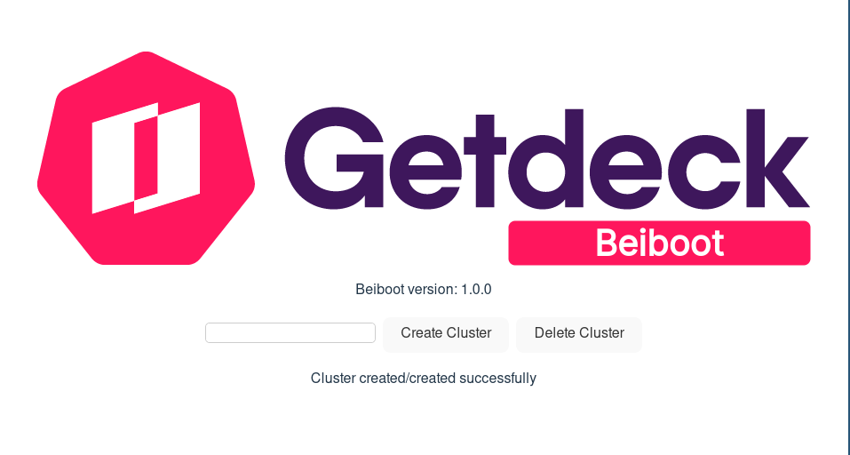

# Beiboot Desktop

## Usage

### Prerequisites

To successfully use Beiboot Desktop you need to have `kubectl` installed and your current cluster needs to have Beiboot installed. Check out [Beiboot](https://github.com/Getdeck/beiboot#getting-started) to see how to get started.

### Installation

Since Beiboot Desktop is in early stages of the development, there is no stable release yet. The fastest way to get a preview is downloading the AppImage from our Github Actions. Go [here](https://github.com/Getdeck/beiboot-desktop/actions?query=branch%3Amain++), select the latest run and obtain your package at the bottom of the page in the Artifacts section. Now unpack the zip file, make the AppImage executable and run beiboot desktop:

```
unzip beiboot-desktop.zip
cd appimage
chmod +x beiboot-desktop_0.1.0_amd64.AppImage
./beiboot-desktop_0.1.0_amd64.AppImage
```



### Features

- Create and delete virtual clusters using beiboot

## Development

In order to run and build the application, you need at first follow [the tauri setup guide](https://tauri.app/v1/guides/getting-started/prerequisites/).

Now you should be able to run `npm run tauri dev` to see a development build with hotreloading.

In order to build an AppImage, you can run `npm run deploy`.
